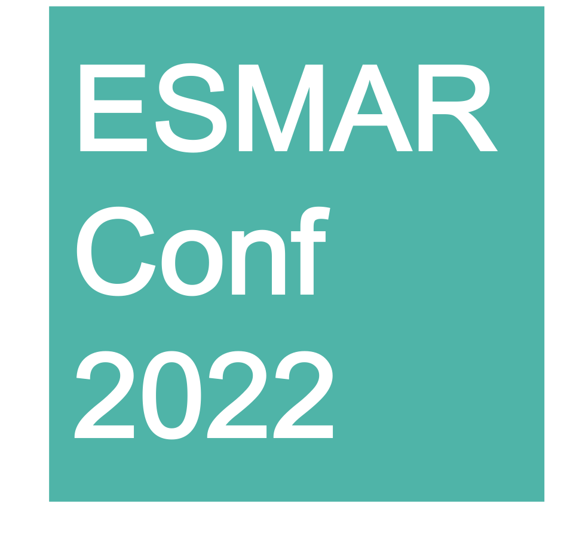

  

# ESMARConf2022 proposals for sessions, workshops and hackathon projects  

Please use this repository to list your proposals for sessions, workshops and hackathon projects.  
- <em>Sessions</em> will be themed blocks of time within the core conference programme dedicated to a particular concept, run as a series of short talks, panel discussions or similar.  
- <em>Workshops</em> will be interactive events aimed at building awareness and capacity amongst attendees for a particular tool, practice or method.  
- <em>Hackathon</em> projects will focus on particular problems/objectives or tools and can either involve the development of code/functions/packages or frameworks/discussion papers/commentaries.  

This year our proposal process will have two steps.  
1. The first step will be to list your ideas in the <a href="https://github.com/ESHackathon/ESMARConf2022_proposals/issues">Github Issues</a>. This is an optional step, but by listing it here and early* in the submission stage, you will be allowing others interested in ESMARConf2022 to see what topics might be addressed. By making this information public before you submit, you can share ideas, network with others and collaborate on joint ideas. *We suggest listing your idea as soon as proposals open and sharing your listing via Tweet, etc. to increase engagement and potential for collaboration.  
2. The second step is the actual formal submission of your proposal via <a href="https://forms.gle/p7gVbvx4DKsnHS4e8" target="_blank">this submission form</a> before September 1st 2021.  

Please add your suggestion as an 'issue' (click <a href="https://github.com/ESHackathon/ESMARConf2022_proposals/issues">here to see the proposals under 'Issues'</a>). Add your title, a short description, and any other information you feel would be useful to facilitate sharing, networking and collaboration.

Please remember to submit your final proposals using <a href="https://forms.gle/p7gVbvx4DKsnHS4e8" target="_blank">this submission form</a> before September 1st 2021.

Visit the <a href="https://www.eshackathon.org/events/2022-01-ESMARConf2022.html" target="_blank">ESMARConf2022 web page</a> at the <a href="https://www.eshackathon.org/" target="_blank">Evidence Synthesis Hackathon</a>.
